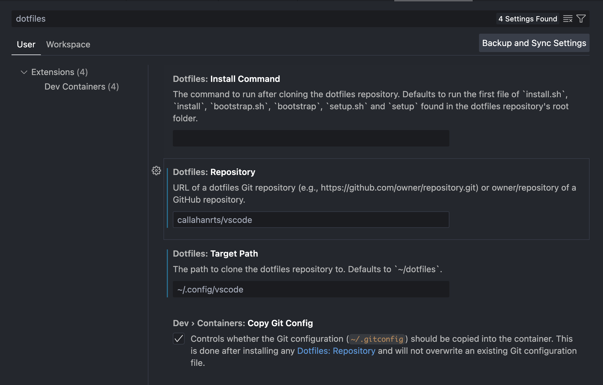

# VSCode settings

## Setup
1. Make sure your VSCode settings are updated to install this repository

3. Move `settings.json`, `keybindings.json`, and anything in `snippets/` into this repository if you want those copied over. Keep an eye out for any API keys or credentials VSCode might store in your settings.json--especially if you keep this repo public.
